# موج ابزار — Autonode

**موج ابزار** (به لاتین: Autonode) یک وب‌اپ موبایل‌محور و فارسی برای ساختن کسب‌وکار با کمک هوش مصنوعی: مسیر یادگیری هفت‌سطحی، کوچ گفتگومحور، فهرست ابزارها، هفت ابزار AI که واقعاً اجرا می‌شوند، و یک بوم زنده‌ی خودکارسازی فروش که پشتش یک بک‌اند کارکننده است.

راست‌به‌چپ به‌صورت پیش‌فرض، و هر رشته‌ی قابل‌مشاهده دوزبانه (فارسی/انگلیسی) است.

---

## شروع سریع

```bash
npm install
npm run seed -- --fresh   # اختیاری: یک ماه داده‌ی نمونه برای اینکه صفحه‌ها خالی نباشند
npm run dev               # API روی :8787 و اپ روی :5173
```

بعد `http://127.0.0.1:5173/` را باز کنید.

**هیچ کلیدی لازم نیست.** با `.env` خالی کل قیف کار می‌کند: کانال‌هایی که کلید ندارند پیام را ثبت می‌کنند و نمی‌فرستند، متن‌ها به‌جای مدل از قالب می‌آید، و پرداخت یک صفحه‌ی محلی است که هیچ پولی جابه‌جا نمی‌کند. `GET /api/health` همیشه می‌گوید کدام نیمه واقعی است.

---

## نگاهی به اپ

| داشبورد | مراحل | پروفایل |
| :---: | :---: | :---: |
| 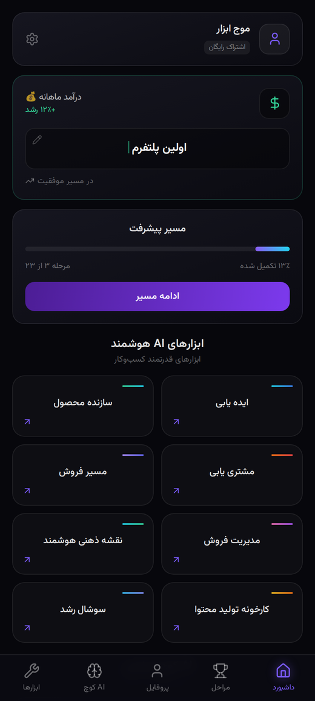 | 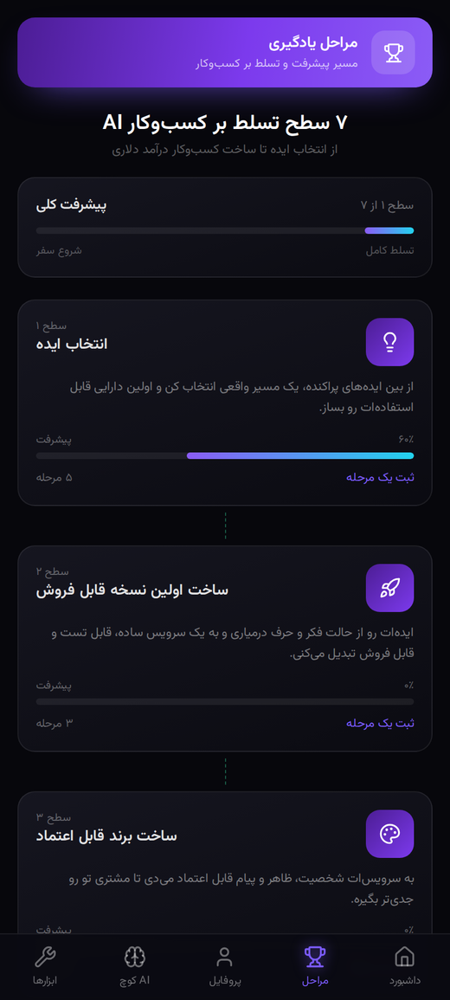 | 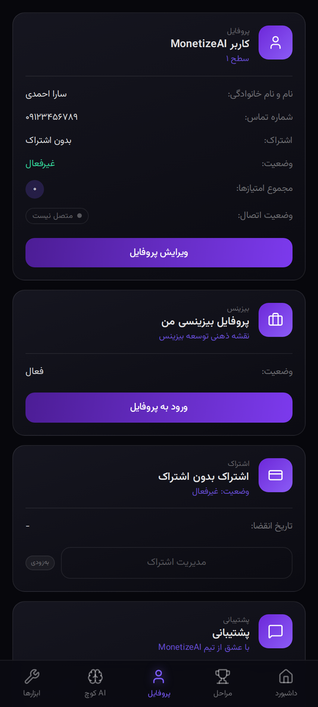 |
| تیتر درآمد قابل ویرایش، نوار پیشرفت ۲۳ مرحله، هشت ابزار AI و کارت کوچ | هفت سطح با نوار پیشرفت هرکدام؛ «ثبت یک مرحله» در دیتابیس می‌ماند | پروفایل قابل ویرایش، بیزینس، اشتراک، پشتیبانی و امنیت |

| AI کوچ | ابزارها | ابزارهای خارجی |
| :---: | :---: | :---: |
| 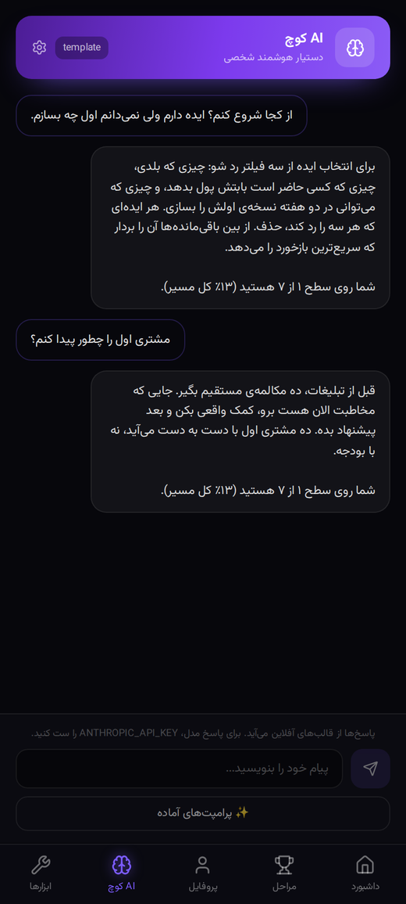 | 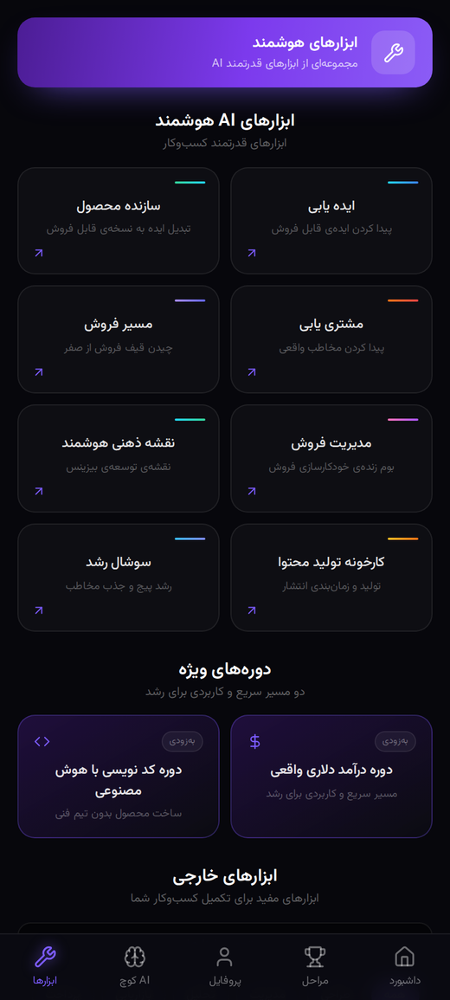 | 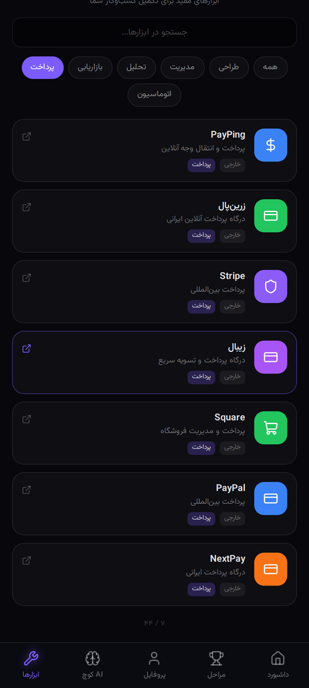 |
| گفتگو با تاریخچه‌ی ذخیره‌شده و پرامپت‌های آماده | هشت ابزار AI، دو دوره، و ۴۴ ابزار خارجی | جستجو و فیلتر دسته‌بندی روی فهرست ابزارها |

| اجرای یک ابزار | ورود (وقتی رمز ست شده باشد) |
| :---: | :---: |
| 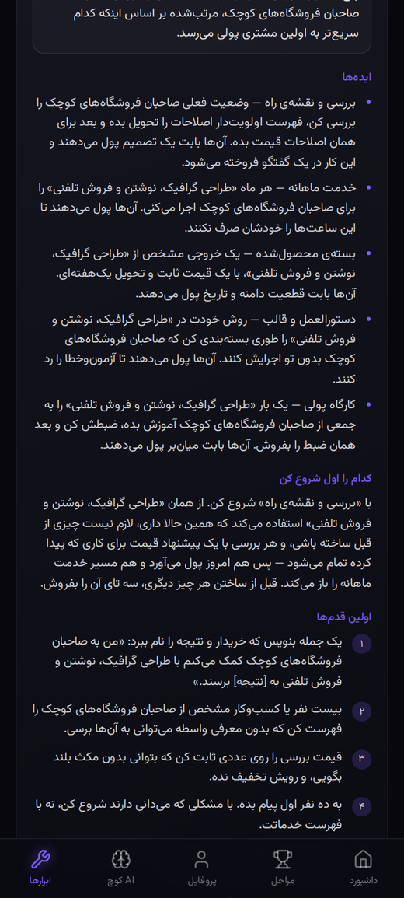 | 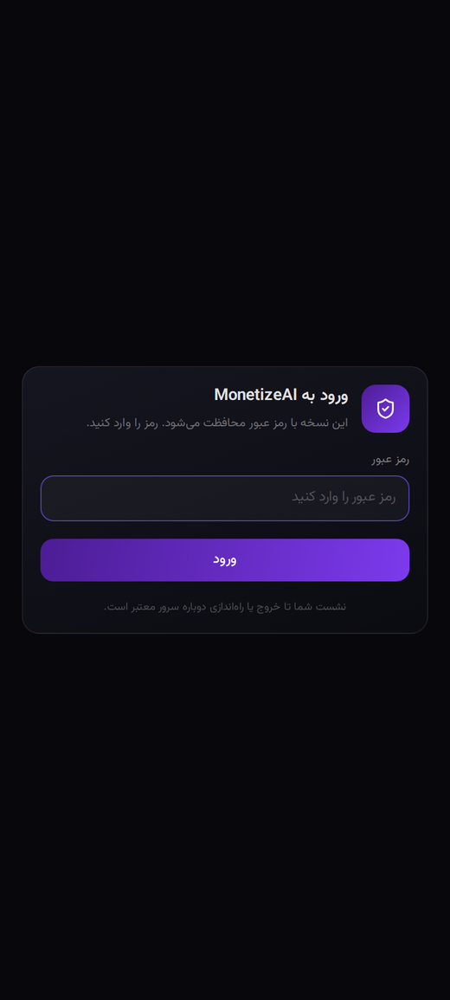 |
| فرم از روی spec ساخته می‌شود و پاسخ ساختاریافته برمی‌گردد | احراز هویت opt-in است؛ بدون رمز اصلاً نمایش داده نمی‌شود |

### بوم خودکارسازی فروش

ابزار «مدیریت فروش» این بوم را باز می‌کند: لید وارد می‌شود، از روی تاریخچه‌ی رویدادهای خودش امتیاز می‌گیرد، به مسیر داغ/گرم/سرد می‌رود، سکانس نرچر را طی می‌کند، جلسه می‌گیرد، پرداخت می‌کند — و بخشی از همان پرداخت به کانالی که لید را ساخته برمی‌گردد. بوم این‌ها را زنده نشان می‌دهد.

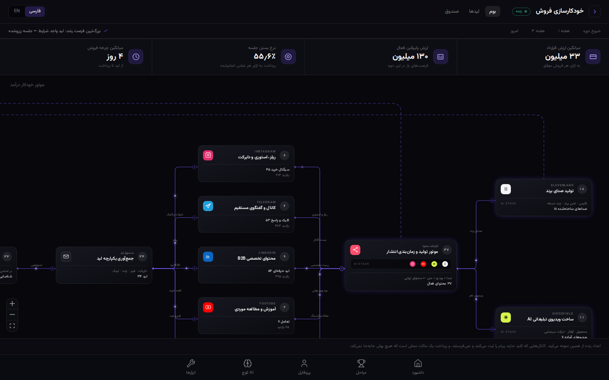

| لیدها | صندوق پیام |
| :---: | :---: |
| 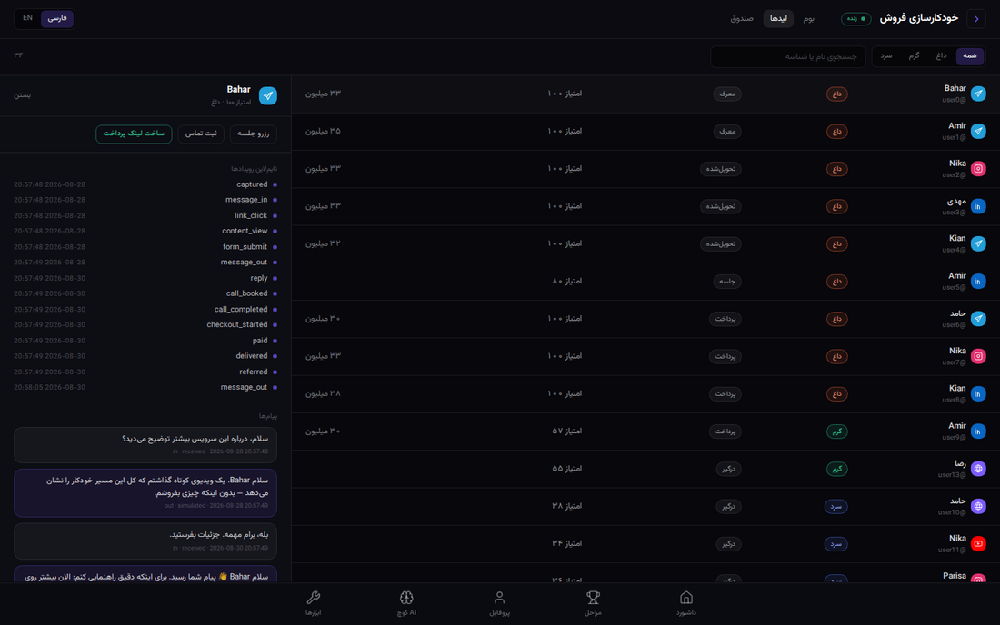 | 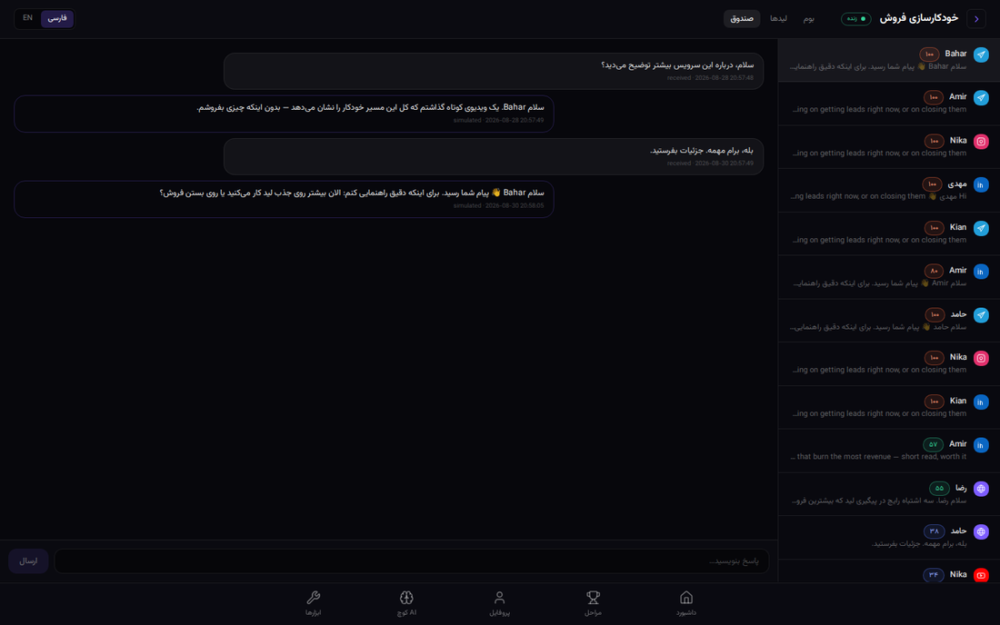 |
| جدول لیدها با فیلتر مسیر و کشوی تایم‌لاین رویدادها | گفتگوها با امکان پاسخ دستی از همان کانال |

هر نودی روی بوم قابل لمس است: می‌گوید چه کار می‌کند، خودش جلو می‌رود یا منتظر توست، چه چیزی را ثبت می‌کند و تحویل نمی‌دهد، و اگر به داده‌ی تو نیاز دارد کدام فیلد خالی است.

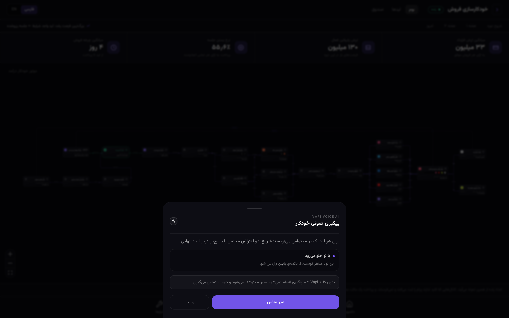

| کارخانه‌ی محتوا | میز تماس | استودیو | پروفایل بیزینسی |
| :---: | :---: | :---: | :---: |
| 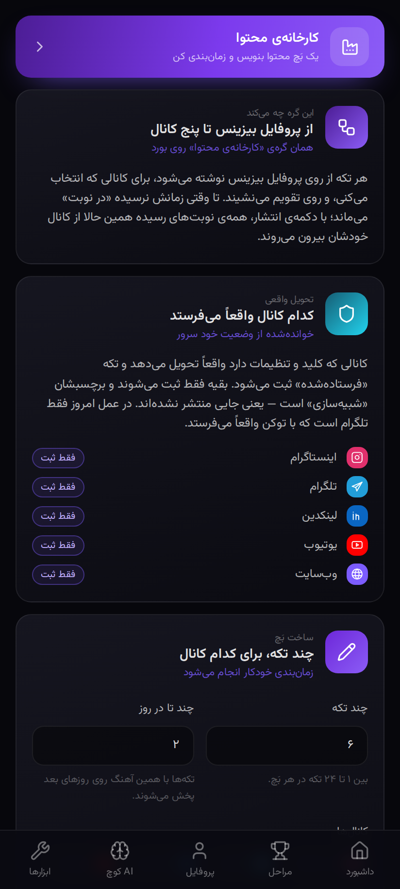 | 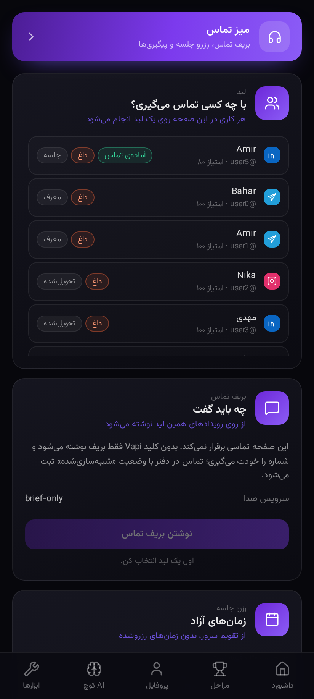 | 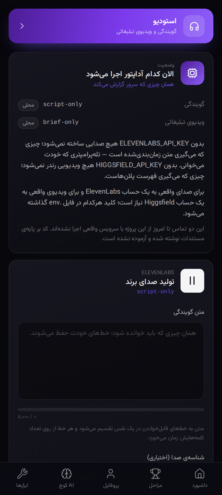 | 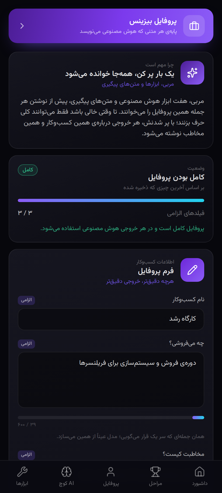 |
| بنویس، زمان‌بندی کن، منتشر کن | بریف تماس، زمان‌های آزاد، رزرو جلسه | گویندگی و ویدیوی تبلیغاتی | چیزی که هر متن تولیدشده بر پایه‌ی آن نوشته می‌شود |

---

## پنج تب

| تب | مسیر | چه کاری می‌کند |
| --- | --- | --- |
| داشبورد | `#/` | تیتر درآمد قابل ویرایش، پیشرفت ۲۳ مرحله، هشت ابزار AI، کوچ |
| مراحل | `#/levels` | هفت سطح؛ ثبت هر مرحله ذخیره می‌شود و نوار کلی را جلو می‌برد |
| پروفایل | `#/profile` | پروفایل (قابل ویرایش)، بیزینس، اشتراک، پشتیبانی، امنیت |
| AI کوچ | `#/ai-coach` | چت با کوچ، با تاریخچه و پرامپت‌های آماده |
| ابزارها | `#/tools` | هشت ابزار AI، دو دوره، ۴۴ ابزار خارجی با جستجو و فیلتر |

صفحه‌هایی که از روی بوم باز می‌شوند، تب نیستند:

| صفحه | مسیر | چه کاری می‌کند |
| --- | --- | --- |
| پروفایل بیزینسی | `#/business` | چیزی که کوچ، ابزارها، محتوا و بریف تماس همه از رویش می‌نویسند |
| کارخانه‌ی محتوا | `#/content` | یک بَچ محتوا می‌نویسد، زمان‌بندی می‌کند و سررسیدها را منتشر می‌کند |
| میز تماس | `#/calls` | بریف تماس، زمان‌های آزاد، رزرو جلسه، یادآور و درخواست معرفی |
| استودیو | `#/studio` | گویندگی و ویدیوی تبلیغاتی؛ بدون کلید، متن زمان‌بندی‌شده و استوری‌بورد |

هر ابزار AI روی `#/tools/:id` باز می‌شود: فرمی که از spec خودش ساخته شده، یک پاسخ ساختاریافته، و تاریخچه‌ی اجراهای قبلی. پاسخ خودش می‌گوید مدل تولیدش کرده یا قالب آفلاین.

---

## چه چیزی واقعی است و چه چیزی نه

این جدول باید صادق بماند. اگر چیزی از ستون راست ساخته شد، در همان کامیت جابه‌جا شود.

| بخش | وضعیت |
| --- | --- |
| دریافت لید، امتیازدهی، روتینگ، نرچر، مراحل CRM، حلقه‌ی رشد | واقعی، محلی اجرا می‌شود |
| پروفایل، پیشرفت سطح‌ها، تاریخچه‌ی کوچ | واقعی، در دیتابیس |
| پروفایل بیزینسی | واقعی — هر کلمه‌ای که تولید می‌شود از رویش نوشته می‌شود |
| کارخانه‌ی محتوا | واقعی — می‌نویسد، زمان‌بندی می‌کند، و کارگر پس‌زمینه سررسیدها را منتشر می‌کند |
| جلسه، یادآور، درخواست معرفی | واقعی — زمان‌های آزاد، رزرو، یادآور، و یک درخواست معرفی به‌ازای هر مشتری |
| بریف تماس | واقعی — چیزی که کلید Vapi لازم دارد فقط شماره‌گیری است |
| تلگرام | **ارسال و دریافت واقعی** با `TELEGRAM_BOT_TOKEN` |
| اینستاگرام / لینکدین / یوتیوب / وب‌سایت | وبهوک امضاشده برای ورودی؛ خروجی ثبت می‌شود ولی ارسال نمی‌شود (این‌ها اکانت بیزنس و تأیید پلتفرم می‌خواهند) |
| کوچ، متن پیگیری و هفت ابزار AI | با `ANTHROPIC_API_KEY` مدل Claude، وگرنه قالب‌های آفلاین |
| احراز هویت | واقعی و **opt-in** — پایین را ببینید |
| چک‌آوت و پرداخت | ماکت محلی — **نه درگاهی، نه پولی** |
| گویندگی (ElevenLabs) | بدون کلید: متن زمان‌بندی‌شده و قابل خواندن. با `ELEVENLABS_API_KEY` صدای واقعی — **این تماس تا امروز اجرا نشده** |
| ویدیوی تبلیغاتی (Higgsfield) | بدون کلید: استوری‌بورد پلان‌به‌پلان. با `HIGGSFIELD_API_KEY` رندر واقعی — **این تماس هم اجرا نشده** |
| شماره‌گیری (Vapi) | بدون کلید انجام نمی‌شود؛ بریف نوشته می‌شود و خودت تماس می‌گیری |
| دو دوره، مدیریت اشتراک، تنظیمات حریم خصوصی، خروج از حساب | ساخته نشده — به‌جای تظاهر، بج **به‌زودی** دارند |

برای روشن‌کردن هرکدام، `.env.example` را به `.env` کپی کنید. `.env` در `.gitignore` است؛ هیچ توکنی نباید کامیت شود.

---

## اگر بخواهی همه‌چیز واقعاً تحویل بدهد

اپ با `.env` خالی کامل کار می‌کند. این جدول فقط می‌گوید هر کلید چه چیزی را از «ثبت‌شده» به «تحویل‌شده» تبدیل می‌کند.

| سرویس | برای چه | هزینه و شرط |
| --- | --- | --- |
| بات تلگرام | ارسال و دریافت واقعی پیام | رایگان و آنی؛ فقط `@BotFather` |
| Anthropic | کوچ، متن پیگیری، محتوا و بریف تماس با Claude به‌جای قالب | کلید API؛ بدون بررسی |
| ElevenLabs | صدای واقعی به‌جای متن زمان‌بندی‌شده | حساب پولی؛ برای استفاده‌ی تجاری تیر Creator به بالا |
| Higgsfield | ویدیوی رندرشده به‌جای استوری‌بورد | حساب پولی با دسترسی API |
| Vapi | شماره‌گیری واقعی به‌جای بریفی که خودت اجرا می‌کنی | حساب پولی |
| اینستاگرام / لینکدین / یوتیوب | ارسال واقعی خروجی | اکانت بیزنس و **تأیید پلتفرم** — تنها موردی که فقط با پول حل نمی‌شود |
| درگاه پرداخت | پول واقعی | چک‌آوت امروز ماکت محلی است؛ بدون درخواست صریح مالک هیچ درگاهی اضافه نمی‌شود |

**MCP لازم نیست.** MCP ابزار را به دست یک دستیار می‌دهد؛ اینجا خودِ اپ باید با سرویس‌ها حرف بزند، آن هم وقتی هیچ دستیاری باز نیست — کارگر پس‌زمینه نیمه‌شب هم پیام می‌فرستد. برای همین هر سرویس یک آداپتور با `fetch` دارد که تست‌پذیر است و روی سرور می‌چرخد.

---

## روشن‌کردن تلگرام

۱. با [@BotFather](https://t.me/botfather) یک بات بسازید و توکنش را بردارید.
۲. `TELEGRAM_BOT_TOKEN` و یک `TELEGRAM_WEBHOOK_SECRET` ثابت را در `.env` بگذارید:
   ```bash
   node -e "console.log(require('crypto').randomBytes(16).toString('hex'))"
   ```
۳. API را روی یک آدرس عمومی در دسترس قرار دهید و `PUBLIC_URL` را همان بگذارید.
۴. `npm run telegram:register`

حالا به بات `/start` بدهید: لید در `#/leads` ظاهر می‌شود، اولین پیام سکانس واقعاً می‌رسد، و پاسخ‌دادن به آن لید را دوباره امتیازدهی می‌کند.

---

## احراز هویت

پیش‌فرض خاموش است. اگر `APP_PASSWORD` (یا `APP_PASSWORD_HASH` از پیش محاسبه‌شده) را ست کنید، API همه‌ی مسیرها را می‌بندد به‌جز `GET /api/health`، `/api/auth/*`، وبهوک‌ها و صفحه‌ی چک‌آوت — و اپ صفحه‌ی ورود نشان می‌دهد.

رمز با `scrypt` و یک salt تصادفی بررسی می‌شود، توکن نشست با HMAC امضا و منقضی می‌شود، و در کوکی `HttpOnly; SameSite=Lax` سفر می‌کند. پنج تلاش ناموفق از یک آدرس، پانزده دقیقه قفل می‌آورد.

نشست‌ها در حافظه‌اند، پس ری‌استارت سرور همه را خارج می‌کند. این عمدی است — نه تغییر schema، نه دسترسی دیتابیس از لایه‌ی احراز هویت — ولی قبل از اتکا به آن بدانیدش.

---

## معماری

```
server/
  domain/     توابع خالص و بدون I/O — امتیازدهی، روتینگ، سکانس‌ها، سطح‌ها، نمای بوم
  db/         schema.sql و queries.ts — هر SQL پروژه اینجاست
  adapters/   یک interface برای هر سرویس بیرونی، با نسخه‌ی واقعی و fallback
  tools/      اجراکننده‌ی هفت ابزار AI و قالب‌های آفلاینشان
  content/    کارخانه‌ی محتوا: تولید، زمان‌بندی، انتشار سررسیدها
  calls/      بریف، زمان‌های آزاد، رزرو، یادآور و درخواست معرفی
  media/      کارهای گویندگی و ویدیو؛ ثبت می‌شوند و هرگز throw نمی‌کنند
  jobs/       یک پاس کارگر: نرچر سررسیده، محتوای سررسیده، کار تماس سررسیده
  routes/     لایه‌ی نازک HTTP
  auth.ts     احراز هویت opt-in
  service.ts  ارکستراسیون: دریافت ← امتیاز ← روت ← نرچر ← فروش ← حلقه
shared/
  aiToolSpecs.ts   قرارداد ابزارها؛ سرور و کلاینت هر دو همین را import می‌کنند
  business.ts      پروفایل بیزینسی، با همان شکل در هر دو نیمه
src/
  data/       tools.ts · levels.ts · pipeline.ts · nodeGuide.ts — هر فهرست،
              برچسب و توضیح نود، دوزبانه
  components/ AppShell · TabBar · PageBanner · Card · Icon · NodeSheet
  api/        کلاینت fetch و هوک‌ها؛ هیچ کامپوننتی مستقیم fetch نمی‌زند
  i18n/       t()/n() و errors.ts که کدهای `field:code` سرور را جمله می‌کند
  pages/      یک فایل برای هر مسیر
```

**امتیازدهی** (`server/domain/scoring.ts`) از جدول append-only رویدادها خوانده می‌شود: وزن کانال کف را می‌سازد، هر رویداد امتیاز اضافه می‌کند، و سهم هر رویداد بعد از ده روز نصف می‌شود تا یک انفجار قدیمی لید را داغ نگه ندارد. هیچ‌چیز جلوتر از لاگ ذخیره نمی‌شود، پس امتیاز همیشه قابل بازتولید است.

**روتینگ** (`server/domain/routing.ts`) این است: داغ `≥ ۸۰`، گرم `≥ ۵۵`، و سرد پایین‌تر. تخته‌ی مرجع سرد را `<۴۵` نوشته بود که بازه‌ی ۴۵ تا ۵۴ را بی‌صاحب می‌گذاشت؛ برچسب یال حالا `cold <55` است تا تصویر و کد یکی باشند.

**بوم زنده.** `src/data/pipeline.ts` چیدمان، متن و یک عدد fallback برای هر خانه دارد. `GET /api/pipeline` همان خانه‌ها را با کلید `<nodeId>.<slot>` برمی‌گرداند و `GET /api/stream` هر رویداد را با یالی که رویش حرکت می‌کند پوش می‌کند، پس یک لید واقعی یک پالس واقعی می‌زند. اگر API خاموش باشد بوم با اعداد fallback بالا می‌آید و کار می‌کند.

**آداپتورها.** `server/adapters/registry.ts` وقتی کلید هست نسخه‌ی واقعی و وگرنه fallback را برمی‌دارد، پس هیچ مسیر کدی مشروط به داشتن کلید نیست.

---

## دستورها

| دستور | کار |
| --- | --- |
| `npm run dev` | API و اپ با هم |
| `npm run dev:api` / `npm run dev:web` | هرکدام جدا |
| `npm run typecheck` | `tsc -b` روی هر سه پروژه‌ی tsconfig |
| `npm run build` | تایپ‌چک و باندل پروداکشن |
| `npm test` | تست‌های دامنه و مسیرها (`node --test`) |
| `npm run e2e` | یک لید از دریافت تا بودجه‌ی بازگشتی، روی دیتابیس یک‌بارمصرف |
| `npm run seed -- --fresh` | ساخت دوباره‌ی دیتابیس نمونه (`data/autonode.db`) |
| `npm start` | اجرای پروداکشن (با `SERVE_STATIC=true` هر دو نیمه روی یک مبدأ) |
| `npm run telegram:register` | ست‌کردن وبهوک تلگرام |

---

## توسعه

`CLAUDE.md` قوانین پروژه است — یک منبع حقیقت برای هر فهرست، هر رشته دوزبانه، RTL با logical properties، هر سرویس بیرونی پشت آداپتور، و «هیچ فیچری جعل نشود». قبل از تغییر بخوانیدش.

زیر `.claude/skills/` پنج اسکیل مخصوص پروژه هست: `verify` (حلقه‌ی کامل تأیید)، `add-tool`، `add-adapter`، `add-page` و `shoot`.

---

## دیپلوی

سه راه، از کامل‌ترین به سبک‌ترین.

### ۱. تک‌مبدأ با Docker — نسخه‌ی کامل

یک ایمیج، یک پروسه: API بالا و اپ ساخته‌شده زیرش، هر دو روی یک مبدأ. همین تک‌مبدأ بودن است که کوکی نشست را کار می‌اندازد و CORS را از میان برمی‌دارد.

```bash
docker build -t autonode .
docker run -p 8787:8787 \
  -v autonode-data:/data \
  -e APP_PASSWORD='یک رمز قوی' \
  -e PUBLIC_URL='https://your-domain' \
  -e ANTHROPIC_API_KEY='...' \
  -e TELEGRAM_BOT_TOKEN='...' \
  -e TELEGRAM_WEBHOOK_SECRET='...' \
  autonode
```

دیتابیس تنها چیزی است که نوشته می‌شود؛ `/data` را volume بگیرید وگرنه با هر ری‌استارت کانتینر از دست می‌رود. **حتماً `APP_PASSWORD` بگذارید** — بدون آن اپ روی اینترنت باز است.

### ۲. بدون Docker، روی هر سروری

```bash
npm ci
npm run build
SERVE_STATIC=true APP_PASSWORD='یک رمز قوی' npm start
```

همان حالت تک‌مبدأ، فقط بدون کانتینر. پشت یک reverse proxy با TLS بگذاریدش تا کوکی با `Secure` بیاید.

### ۳. پیش‌نمایش روی GitHub Pages — فقط رابط

هر پوش روی `main` ورک‌فلوی `.github/workflows/pages.yml` را اجرا می‌کند و اپ ساخته‌شده را روی GitHub Pages می‌گذارد. Pages فقط فایل ثابت سرو می‌کند، پس این نسخه **بک‌اند ندارد**:

| کار می‌کند | نمی‌کند |
| --- | --- |
| فهرست ۴۴ ابزار خارجی، جستجو و فیلترها | اجرای ابزارهای AI و چت کوچ |
| بوم فروش با اعداد fallback | اعداد زنده و پالس رویدادها |
| چیدمان و ناوبری هر پنج تب | ذخیره‌ی پیشرفت و پروفایل |

صفحه‌هایی که به API نیاز دارند همان حالت آفلاینی را نشان می‌دهند که برایشان ساخته شده — چیزی نمی‌شکند و چیزی هم تظاهر نمی‌کند. اگر بک‌اند را جایی هاست کردید، کافی است متغیر مخزن `VITE_API_URL` را روی آدرسش بگذارید تا همین دیپلوی کامل شود.

---

## قبل از دیپلوی

اول یک رمز ست کنید. بعد یک چیز هنوز باز است:

`POST /api/webhooks/payment` نه مسیر مخفی دارد نه HMAC، پس هرکسی که به آن برسد می‌تواند ادعا کند پرداختی انجام شده. تا وقتی درگاه واقعی نیست این فقط عدد داشبورد را خراب می‌کند، ولی قبل از هر پرداخت واقعی باید بسته شود.

نکته‌ی CORS که قبلاً اینجا بود با حالت تک‌مبدأ حل شد — در آن حالت مرورگر اصلاً درخواست cross-origin نمی‌فرستد.

---

ساخته‌شده با Vite، React، TypeScript، Tailwind CSS، `@xyflow/react`، Fastify و `node:sqlite`.
